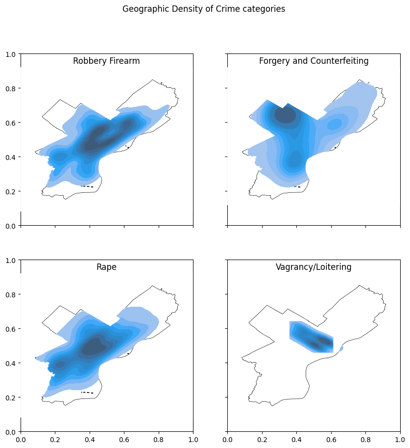

# Crime Prediction in Philadelphia
##### *- A Geospatial Data Analysis to forecast crime patterns based on time and location*

## Introduction
This repository contains files for the individual course project in 594: Data Science for Software Engineers (fall 2022) created by Hariraj Venkatesan for partial fulfillment of the course requirements.

It was cleared by course staff (R. Acuna, V. Gupta) for public release on 4/10/2023.

## Problem Statement

The project aims to forecast crime rates in Philadelphia by considering location and time, addressing the scientific challenge of predicting crime accurately. It aims to identify vulnerable areas with increased criminal activity for specific crimes, aiding law enforcement in enhancing public safety.

**Dataset description:**
The Crime Incidents data was downloaded from [OpenDataPhilly](https://www.opendataphilly.org/dataset/crime-incidents).

